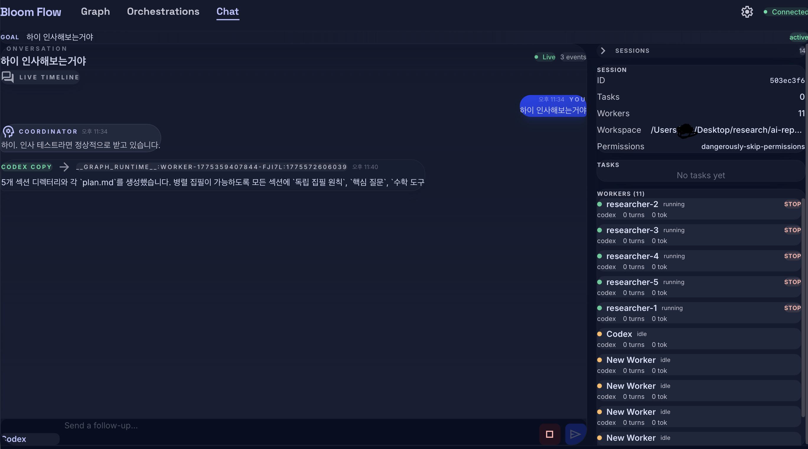

# Bloom Flow

Bloom Flow is a local-first multi-agent orchestration app for people who want a visual interface on top of real coding CLIs.

It supports:

- Chat-based coordination with a persistent coordinator and worker pool
- Graph-based orchestration for reusable multi-step workflows
- Saved orchestration templates
- Direct local execution through `codex`, `gemini`, and `claude` CLIs
- Cross-worker messaging and per-agent session persistence

Unlike proxy-based architectures, Bloom Flow does not depend on an OpenAI-compatible LLM proxy. It runs the installed provider CLIs directly in non-interactive mode and stores each agent's provider session ID so workers can resume with continuity across turns.

## Screenshots

### Chat



### Graph Editor


### Orchestration Templates


## What It Does

- Start a chat session with a coordinator that can create tasks, spawn workers, continue existing workers, and summarize results
- Build multi-agent graphs with worker, branch, loop, input, and output nodes
- Reuse workers across turns and graph runs
- Route messages between teammates through Bloom's internal mailbox layer
- Persist Bloom sessions locally while also persisting provider-native sessions for Codex, Gemini, and Claude

## Why This Repo Exists

This repo is the shareable, public version of Bloom Flow.

The runtime intentionally avoids proxying vendor APIs behind a custom OpenAI-compatible gateway. Instead, it shells out to the actual local CLIs. That keeps the architecture simpler, avoids provider-policy ambiguity around API proxy layers, and makes the execution model easier to audit.

## Architecture

This repo is a small monorepo:

- `packages/web`: React + Vite frontend
- `packages/server`: Fastify + WebSocket backend, orchestration runtime, worker lifecycle, session store, and CLI adapters
- `packages/shared`: shared protocol and type definitions
- `screenshots`: README assets

Core runtime pieces:

- Coordinator loop: interprets user intent and emits Bloom command blocks
- Worker loop: runs persistent workers and supports teammate messaging
- Local CLI adapter layer: executes `codex`, `gemini`, or `claude` in non-interactive mode
- Session store: persists Bloom state in `~/.bloom`

## Requirements

- Node.js 20+
- npm
- At least one authenticated local provider CLI:
  - `codex`
  - `gemini`
  - `claude`

If a provider CLI is installed but not authenticated, Bloom Flow can still run with the providers that are available.

## Getting Started

Install dependencies:

```bash
npm install
```

Start the app in development:

```bash
npm run dev
```

This starts:

- the server on `http://127.0.0.1:3101`
- the web app on `http://127.0.0.1:3102`

Run a production build check:

```bash
npm run check
```

## Backend Selection

Bloom Flow uses simple backend names throughout the UI and runtime:

- `codex`
- `gemini`
- `claude`

Each agent stores its provider session ID after the first non-interactive call. Follow-up work resumes the same provider session when possible.

## Current Behavior Notes

- Codex and Gemini are fully wired for direct worker execution and cross-worker messaging
- Claude is wired through the same adapter path, but it still depends on a valid local Claude Code subscription/auth state
- Session data is stored locally under `~/.bloom`

## Development Notes

Useful commands:

```bash
npm run dev
npm run build
npm run check
```

The root `check` command builds all workspaces.

## Status

Bloom Flow is functional and usable now, but it is still an evolving orchestration UI rather than a finished platform product. Expect the runtime contract, prompts, and graph behaviors to keep improving.
