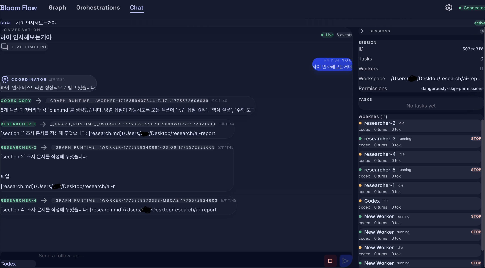
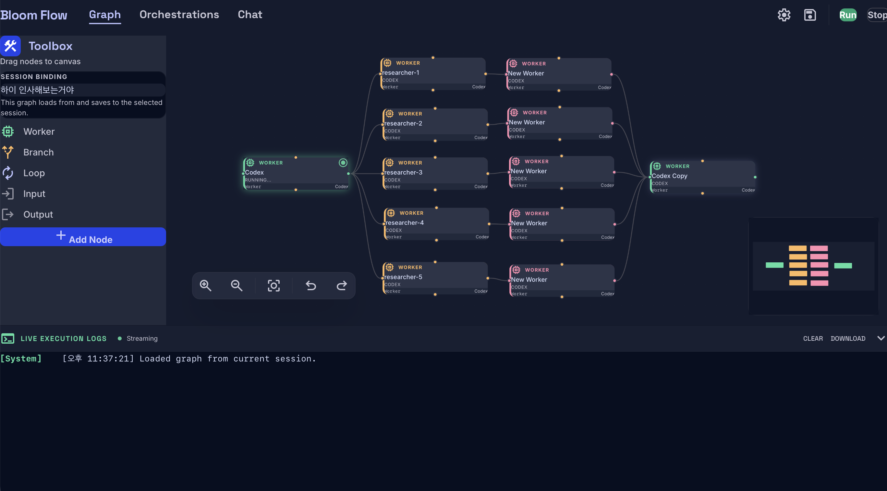
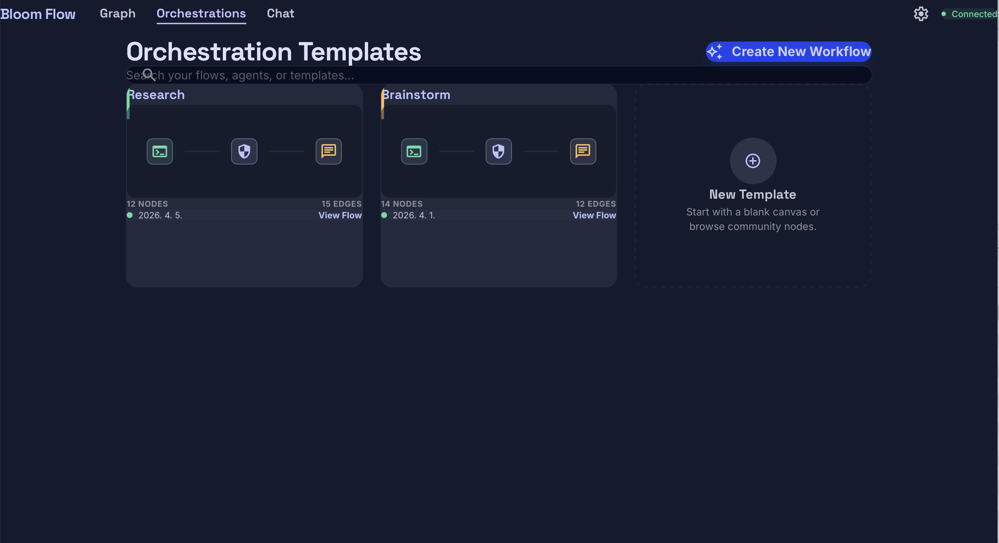

# Bloom Flow

Bloom Flow is a local-first multi-agent workspace for people who want to run real coding CLIs with either autonomous coordination or explicit visual orchestration.

It has two operating modes:

- `Chat mode`: you talk to a coordinator agent, and the coordinator decides how to assemble a team, assign work, message workers, and reallocate effort across the session.
- `Graph mode`: you build the team yourself by placing workers in a graph, assigning each one a role, backend, and prompt, then defining how work flows between them.

Bloom Flow does not rely on an OpenAI-compatible proxy. It calls installed local CLIs like `codex`, `gemini`, and `claude` directly in non-interactive mode, then stores each agent's provider session ID so the same worker can resume across turns.

## Two Ways To Use Bloom Flow

| Mode | What you control | What Bloom controls | Best for |
| --- | --- | --- | --- |
| `Chat mode` | Goal, constraints, follow-up direction | Team composition, worker spawning, delegation, message passing, session continuity | Open-ended tasks where you want the coordinator to manage the team |
| `Graph mode` | Worker layout, roles, backend choice, graph topology, execution flow | Node execution, state passing, persistent worker sessions | Repeatable pipelines and deliberate multi-agent setups |

### Chat Mode

In chat mode, Bloom Flow behaves like a multi-agent command center. You describe the task once, then the coordinator decides:

- whether more workers are needed
- which backend each worker should use
- how work should be split
- when teammates should message each other
- when to continue an existing worker instead of creating a new one

This is the mode for "build the team for me and manage the orchestration."

### Graph Mode

In graph mode, Bloom Flow behaves like a visual orchestration editor. You decide:

- which workers exist
- what each worker is responsible for
- which backend each worker should run on
- how nodes connect
- where branching, looping, inputs, and outputs happen

This is the mode for "I want to design the team structure and execution flow myself."

## Screenshots

### Chat Mode



### Graph Mode



### Saved Templates



## Why This Repo Exists

This repository is the shareable, public version of Bloom Flow.

The runtime intentionally avoids vendor API proxy layers. Instead of translating everything through a custom OpenAI-style endpoint, Bloom Flow shells out to the actual local CLIs. That keeps the public architecture simpler, easier to audit, and less likely to create policy ambiguity around proxying commercial model providers.

## Core Capabilities

- Coordinator-driven chat orchestration with persistent workers
- Visual graph orchestration with reusable worker nodes
- Cross-worker messaging through Bloom's internal mailbox layer
- Direct local execution through `codex`, `gemini`, and `claude`
- Provider-native session persistence so workers can resume with continuity
- Saved orchestration templates for repeatable flows

## Architecture

This repo is a small monorepo:

- `packages/web`: React + Vite frontend
- `packages/server`: Fastify + WebSocket backend, orchestration runtime, worker lifecycle, session store, and CLI adapters
- `packages/shared`: shared protocol and type definitions
- `screenshots`: README assets

Core runtime pieces:

- Coordinator loop: interprets user intent and emits Bloom command blocks
- Worker loop: runs persistent workers and supports teammate messaging
- Local CLI adapter layer: executes `codex`, `gemini`, or `claude` in non-interactive mode
- Session store: persists Bloom state in `~/.bloom`

## Requirements

- Node.js 20+
- npm
- At least one authenticated local provider CLI:
  - `codex`
  - `gemini`
  - `claude`

Current platform note:

- macOS is the primary tested environment right now
- Linux should be workable, depending on local CLI setup
- Windows may not work correctly yet; a Windows compatibility patch is planned soon

If a provider CLI is installed but not authenticated, Bloom Flow can still run with the providers that are available.

## Getting Started

Install dependencies:

```bash
npm install
```

Start the app in development:

```bash
npm run dev
```

This starts:

- the server on `http://127.0.0.1:3101`
- the web app on `http://127.0.0.1:3102`

Run a production build check:

```bash
npm run check
```

## Backend Selection

Bloom Flow uses simple backend names throughout the UI and runtime:

- `codex`
- `gemini`
- `claude`

Each agent stores its provider session ID after the first non-interactive call. Follow-up work resumes the same provider session when possible.

## Current Behavior Notes

- Codex and Gemini are fully wired for direct worker execution and cross-worker messaging
- Claude is wired through the same adapter path, but it still depends on a valid local Claude Code subscription/auth state
- Session data is stored locally under `~/.bloom`

## Development Notes

Useful commands:

```bash
npm run dev
npm run build
npm run check
```

The root `check` command builds all workspaces.

## Status

Bloom Flow is already usable, but it is still evolving. Expect the runtime contract, prompts, and graph behaviors to keep changing as the project matures.
